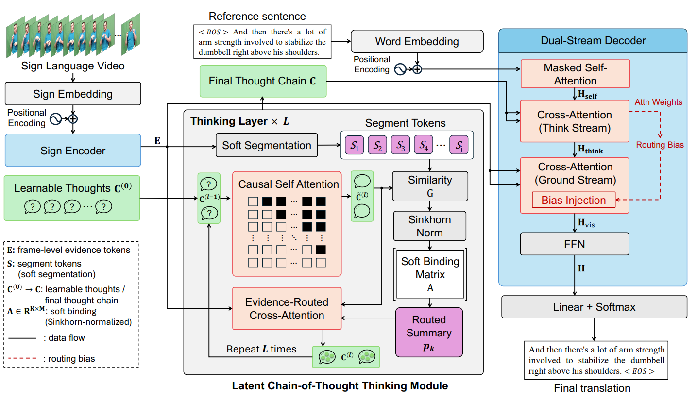

# Think in Latent Thoughts: A New Paradigm for Gloss-Free Sign Language Translation

> **Accepted at ACL 2026 (Main)**


Traditional SLT treats sign video segments as if they were directly mappable to static spoken-language words. This ignores **Productive Forms** in sign languages, constructions built on-the-fly through classifiers, spatial grammar, and motion modulation that cannot be enumerated as fixed lexical entries. A single "vehicle" handshape may express "park," "crash," or "drive" purely through variations in movement and spatial configuration. SignThought addresses this by introducing three key mechanisms:
1. **Latent Thought Abstraction** — An ordered set of K learnable thought slots serves as the model's working memory, progressively distilling and organizing meaning from long, continuous visual streams.
2. **Plan-Ground Decoupling** — Reasoning and grounding are explicitly separated. The model first determines *what* semantic content to express by reasoning over latent thoughts, then decides *where* to retrieve the corresponding visual evidence.
3. **Traceable Evidence Alignment** — Latent thoughts function as traceable anchors that align generated text with specific temporal regions of the input video, enabling explicit evidence attribution and more faithful translations.



## Installation

```bash
git clone https://github.com/fletcherjiang/SignThought.git
cd SignThought
```

Create and activate a conda environment:

```bash
conda create -n signthought python=3.9 -y
conda activate signthought
```

Install PyTorch 2.4.0:

```bash
pip install torch==2.4.0 torchvision==0.19.0 --index-url https://download.pytorch.org/whl/cu121
```

Install remaining dependencies:

```bash
pip install -r requirements.txt
```

## Data & Features

### Visual Features

We use pre-extracted 1024-dim visual features following Voskou et al. (2021). The feature extractor is initialized from an open-sourced Inception network with gloss-dependent supervision removed. It is trained with a sentence-level contrastive objective using only paired sign video–sentence data (no gloss annotations required).

Pre-extracted features for each dataset can be downloaded here:

| Dataset | Features |
|---|---|
| PHOENIX2014T | [link](https://connectpolyu-my.sharepoint.com/:f:/g/personal/25014758r_connect_polyu_hk/IgAnU8PHNGn6Q4jCLm6Yb5UKAfZzqYeZVYgwXWpL_jKey2E?e=YZbi5R) |
| CSL-Daily | [link](https://connectpolyu-my.sharepoint.com/:f:/g/personal/25014758r_connect_polyu_hk/IgAnU8PHNGn6Q4jCLm6Yb5UKAfZzqYeZVYgwXWpL_jKey2E?e=YZbi5R) |

Download the Pre-extracted features from the links below and place them under `data/`:

```
data/
├── PHOENIX2014T/
│   ├── phoenix14t.train
│   ├── phoenix14t.dev
│   └── phoenix14t.test
└── csl/
    ├── csl.train
    ├── csl.dev
    └── csl.test
```

## Training

```bash
# PHOENIX2014T
CUDA_VISIBLE_DEVICES=0 python -m main train configs/sign_phoenix.yaml

# CSL-Daily
CUDA_VISIBLE_DEVICES=0 python -m main train configs/sign_csl.yaml
```

## Inference

```bash
# PHOENIX2014T
CUDA_VISIBLE_DEVICES=0 python -m main test configs/sign_phoenix.yaml \
    --ckpt experiment_results/phoenix14t_auto/best.ckpt

# CSL-Daily
CUDA_VISIBLE_DEVICES=0 python -m main test configs/sign_csl.yaml \
    --ckpt experiment_results/csl_auto/best.ckpt
```

## Configuration

Key parameters can be modified in the yaml files under `configs/`:

| Parameter | Default | Description |
|---|---|---|
| `thinking.K` | 8 | Number of latent thought slots |
| `thinking.num_layers` | 2 | Number of thinking layers |
| `thinking.num_segments` | 8 | Number of soft segment tokens M |
| `training.batch_size` | 32 | Batch size |
| `training.learning_rate` | 1e-3 | Initial learning rate |
| `training.lambda_mono` | 0.1 | Monotonicity regularization weight |
| `training.lambda_cont` | 0.2 | Contiguity regularization weight |

## Citation

```bibtex
@inproceedings{jiang2026signthought,
  title     = {Think in Latent Thoughts: A New Paradigm for Gloss-Free Sign Language Translation},
  author    = {Yiyang Jiang and Li Zhang and Xiaoyong Wei and Qing Li},
  booktitle = {ACL 2026},
  year      = {2026}
}
```
